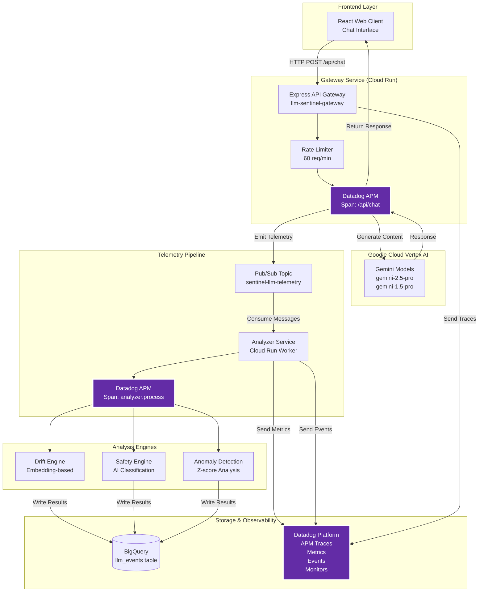
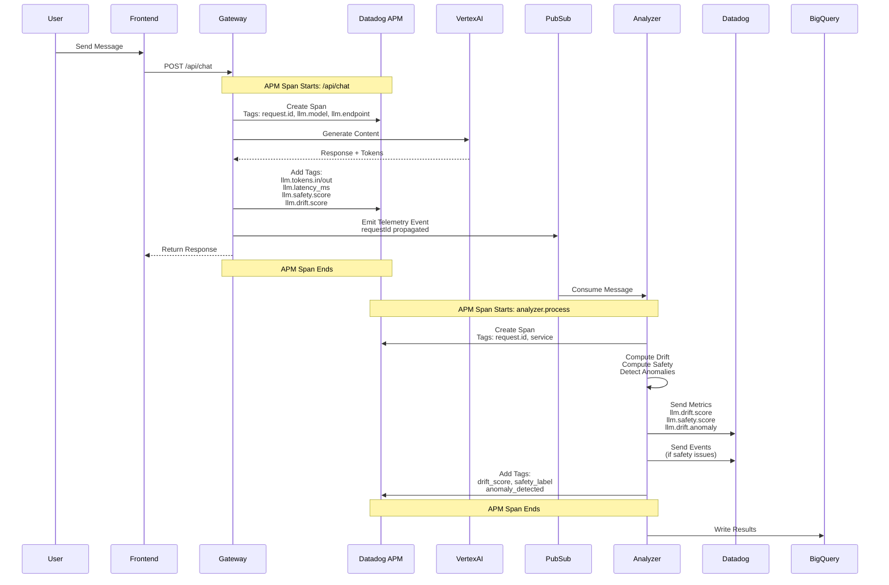

# LLM Drift & Abuse Sentinel - Architecture

## Overview

The LLM Drift & Abuse Sentinel is a comprehensive observability platform for monitoring Large Language Model (LLM) applications on Google Cloud Vertex AI. It provides real-time drift detection, safety classification, and comprehensive APM tracing through Datadog.

## System Architecture



## APM Tracing Flow

The system implements comprehensive distributed tracing using Datadog APM. Here's how traces flow through the system:



## Component Details

### 1. Frontend (React Web Client)

**Technology:** React + Vite + TypeScript  
**Location:** `web/client/`

**Features:**
- Real-time chat interface
- Session management with localStorage persistence
- Safety and drift visualization
- Interactive inspector panel
- Live telemetry ticker
- Dark/Light mode support

**Key Components:**
- `ChatInterface.tsx` - Main chat component
- `Dashboard.tsx` - Overview dashboard
- `AlertsView.tsx` - Security alerts view
- `InspectorPanel.tsx` - Message detail inspector

### 2. Gateway Service

**Technology:** Express.js + TypeScript + Datadog APM  
**Location:** `services/gateway/`  
**Deployment:** Google Cloud Run

**Responsibilities:**
- Handle HTTP requests from frontend
- Call Vertex AI for LLM completions
- Emit telemetry events to Pub/Sub
- Implement rate limiting (60 req/min)
- APM tracing with Datadog

**APM Integration:**
```typescript
// Initialize APM
tracer.init({
  service: 'llm-sentinel-gateway',
  env: process.env.ENVIRONMENT || 'dev',
  version: '1.0.0',
});

// Create spans for each request
const span = tracer.scope().active();
span?.setTag('request.id', requestId);
span?.setTag('llm.model', config.vertex.model);
span?.setTag('llm.tokens.in', tokensIn);
span?.setTag('llm.latency_ms', latencyMs);
```

**Key Endpoints:**
- `POST /api/chat` - Main chat endpoint (APM traced)
- `GET /health/liveness` - Liveness probe
- `GET /health/readiness` - Readiness probe

### 3. Vertex AI Integration

**Models Supported:**
- `gemini-2.5-pro` (europe-west4)
- `gemini-1.5-pro` (us-east1, us-central1)
- `gemini-1.5-flash` (multiple regions)
- `gemini-1.0-pro` (multiple regions)

**Features:**
- System instructions for context
- Token usage tracking
- Error handling with retry logic
- Stub mode for testing

### 4. Telemetry Pipeline

**Technology:** Google Cloud Pub/Sub  
**Topic:** `sentinel-llm-telemetry`

**Event Structure:**
```typescript
{
  requestId: string;        // UUID for tracing
  timestamp: string;        // ISO timestamp
  endpoint: string;         // API endpoint
  prompt: string;           // User input
  response: string;         // LLM response
  tokensIn: number;         // Input tokens
  tokensOut: number;        // Output tokens
  latencyMs: number;        // Request latency
  modelName: string;        // Model used
  status: 'success' | 'error';
}
```

### 5. Analyzer Service

**Technology:** TypeScript + Node.js  
**Location:** `services/analyzer/`  
**Deployment:** Google Cloud Run (Pub/Sub consumer)

**Responsibilities:**
- Consume telemetry events from Pub/Sub
- Compute drift scores using embeddings
- Classify safety issues
- Detect anomalies using Z-score analysis
- Emit metrics and events to Datadog
- Write results to BigQuery

**APM Integration:**
- Creates spans for each message processed
- Tags spans with analysis results
- Correlates with gateway traces via requestId

### 6. Drift Engine

**Technology:** Vertex AI Embeddings (`text-embedding-004`)

**Algorithm:**
1. Generate embedding for each response
2. Maintain baseline embedding per endpoint (EMA)
3. Calculate cosine similarity vs baseline
4. Drift score = 1 - similarity

**Features:**
- Baseline building (first 5 responses)
- Exponential moving average updates
- Embedding cache for performance
- Normalized similarity scores

### 7. Safety Engine

**Technology:** Vertex AI Gemini (`gemini-1.5-flash`)

**Classification:**
- `CLEAN` - Safe content
- `TOXIC` - Toxic language
- `PII` - Personally identifiable information
- `JAILBREAK` - Jailbreak attempts
- `PROMPT_INJECTION` - Prompt injection
- `RISKY` - Other risky content

**Features:**
- Fast classification using Flash model
- Confidence scores (0-1)
- Keyword-based fallback
- Event generation for high-risk content

### 8. Anomaly Detection Engine

**Technology:** Z-score statistical analysis

**Algorithm:**
1. Maintain rolling window of drift scores
2. Calculate mean and standard deviation
3. Compute Z-score for new values
4. Flag anomalies (|Z-score| > 2)

**Features:**
- Real-time anomaly detection
- Configurable thresholds
- Metric emission to Datadog

### 9. Datadog Integration

**APM Traces:**
- **Service:** `llm-sentinel-gateway`
- **Spans:** `/api/chat` endpoint
- **Tags:** request.id, llm.model, llm.tokens.*, llm.latency_ms, llm.safety.*, llm.drift.*

**Metrics (15+ custom metrics):**
- `llm.request.count` - Request count
- `llm.request.error` - Error count
- `llm.request.latency` - Request latency
- `llm.tokens.in` - Input tokens
- `llm.tokens.out` - Output tokens
- `llm.drift.score` - Drift score
- `llm.drift.similarity` - Similarity score
- `llm.drift.anomaly` - Anomaly flag
- `llm.drift.z_score` - Z-score value
- `llm.safety.score` - Safety score
- `llm.safety.event` - Safety event count
- `llm.cost.estimated` - Estimated cost

**Events:**
- High-risk safety issues (score < 0.3)
- Warning-level safety issues (score < 0.5)
- Anomaly detections

**Monitors:**
- High error rate (> 5%)
- High latency (> 1s p95)
- Drift detection (> 0.2)
- Critical safety score (< 0.3)

### 10. BigQuery Storage

**Dataset:** `sentinel_telemetry`  
**Table:** `llm_events`

**Schema:**
- All telemetry event fields
- Computed drift scores
- Safety classifications
- Anomaly flags
- Timestamps for time-series analysis

**Use Cases:**
- Historical analysis
- Trend detection
- Cost analysis
- Compliance reporting

## Data Flow

### Request Flow

1. **User sends message** → Frontend
2. **Frontend** → Gateway (`POST /api/chat`)
3. **Gateway** → Creates APM span, validates input
4. **Gateway** → Vertex AI (generate content)
5. **Gateway** → Adds APM tags (tokens, latency, scores)
6. **Gateway** → Publishes telemetry to Pub/Sub
7. **Gateway** → Returns response to Frontend
8. **Gateway** → Closes APM span

### Analysis Flow

1. **Pub/Sub** → Delivers message to Analyzer
2. **Analyzer** → Creates APM span
3. **Analyzer** → Computes drift (embeddings + similarity)
4. **Analyzer** → Classifies safety (Gemini Flash)
5. **Analyzer** → Detects anomalies (Z-score)
6. **Analyzer** → Emits metrics to Datadog
7. **Analyzer** → Emits events (if high-risk)
8. **Analyzer** → Writes to BigQuery
9. **Analyzer** → Closes APM span

## APM Trace Structure

### Gateway Span

```
Span: /api/chat
├── Service: llm-sentinel-gateway
├── Tags:
│   ├── request.id: <UUID>
│   ├── llm.model: gemini-2.5-pro
│   ├── llm.endpoint: /api/chat
│   ├── llm.tokens.in: 45
│   ├── llm.tokens.out: 128
│   ├── llm.tokens.total: 173
│   ├── llm.latency_ms: 1420
│   ├── llm.response.length: 512
│   ├── llm.safety.score: 0.85
│   ├── llm.safety.label: CLEAN
│   └── llm.drift.score: 0.12
└── Duration: 1420ms
```

### Analyzer Span

```
Span: analyzer.process
├── Service: llm-sentinel-analyzer
├── Tags:
│   ├── request.id: <UUID> (correlated)
│   ├── service: analyzer
│   ├── drift_score: 0.12
│   ├── safety_label: CLEAN
│   ├── anomaly_detected: false
│   └── z_score: 0.5
└── Duration: 250ms
```

## Key Design Decisions

### 1. Async Telemetry Processing
- **Why:** Don't block user requests on analysis
- **How:** Pub/Sub decouples gateway from analyzer
- **Benefit:** Low latency for users, scalable analysis

### 2. Embedding-Based Drift Detection
- **Why:** Captures semantic meaning, not just keywords
- **How:** Vertex AI embeddings + cosine similarity
- **Benefit:** Detects subtle behavior changes

### 3. APM Tracing Integration
- **Why:** End-to-end visibility into request flow
- **How:** Datadog APM with custom tags
- **Benefit:** Correlate latency, errors, and business metrics

### 4. Multi-Layer Safety Detection
- **Why:** Different attack vectors need different detection
- **How:** AI classification + keyword fallback + anomaly detection
- **Benefit:** Comprehensive coverage

### 5. Rich Metric Tagging
- **Why:** Enable powerful filtering and correlation
- **How:** Tag all metrics with context (model, endpoint, safety label)
- **Benefit:** Slice and dice data in Datadog dashboards

## Scalability Considerations

- **Gateway:** Stateless, scales horizontally on Cloud Run
- **Pub/Sub:** Handles high throughput automatically
- **Analyzer:** Can scale multiple instances (Pub/Sub fan-out)
- **BigQuery:** Handles petabytes of data
- **Datadog:** Cloud-native, scales automatically

## Security

- **Rate Limiting:** 60 requests/minute per IP
- **Input Validation:** Sanitization and length limits
- **Authentication:** (Can be added via Cloud IAM)
- **Data Privacy:** PII detection and flagging
- **Error Handling:** No sensitive data in error messages

## Monitoring & Alerting

See `docs/DETECTION_RULES.md` for detailed monitor configurations.

**Key Monitors:**
- Error rate > 5%
- Latency p95 > 1s
- Drift score > 0.2
- Safety score < 0.3
- Availability SLO: 99.9%

## Deployment

See `infra/README.md` for Terraform infrastructure setup.

**Services:**
- Gateway: Cloud Run (us-east1)
- Analyzer: Cloud Run (us-east1)
- Pub/Sub: Regional (us-east1)
- BigQuery: Multi-region

## Related Documentation

- [Observability Strategy](./OBSERVABILITY_STRATEGY.md) - Detailed observability approach
- [Detection Rules](./DETECTION_RULES.md) - Monitor configurations
- [Incident Example](./INCIDENT_EXAMPLE.md) - Incident management workflow
- [README](../README.md) - Getting started guide

